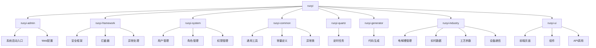
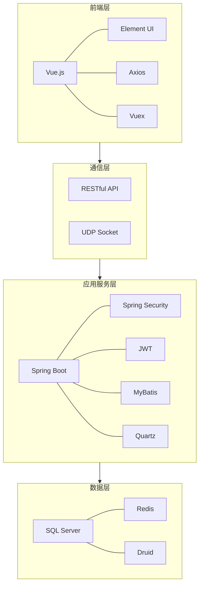
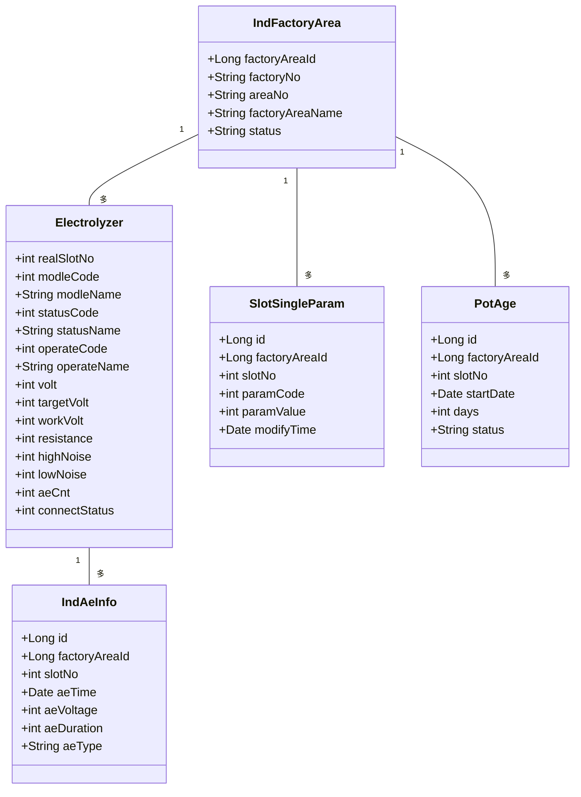
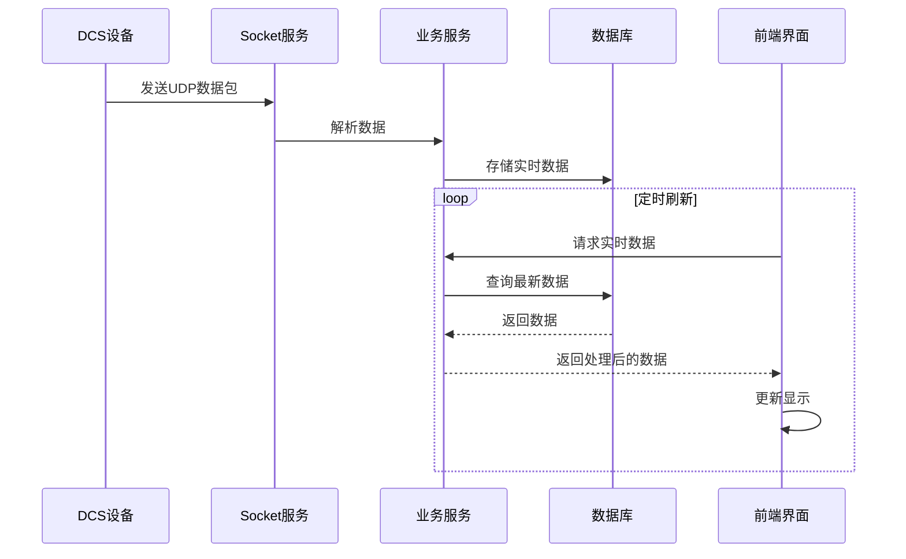
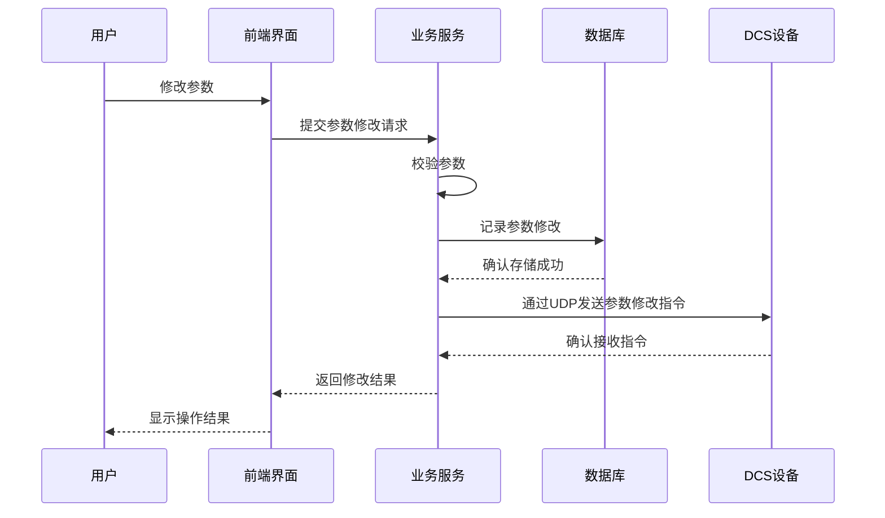
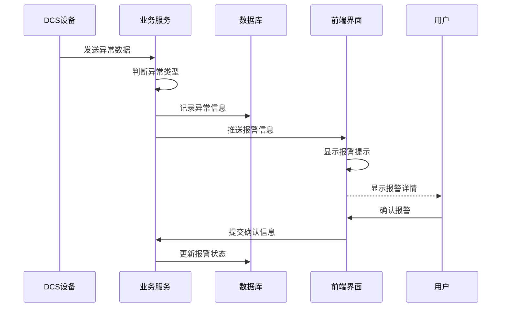
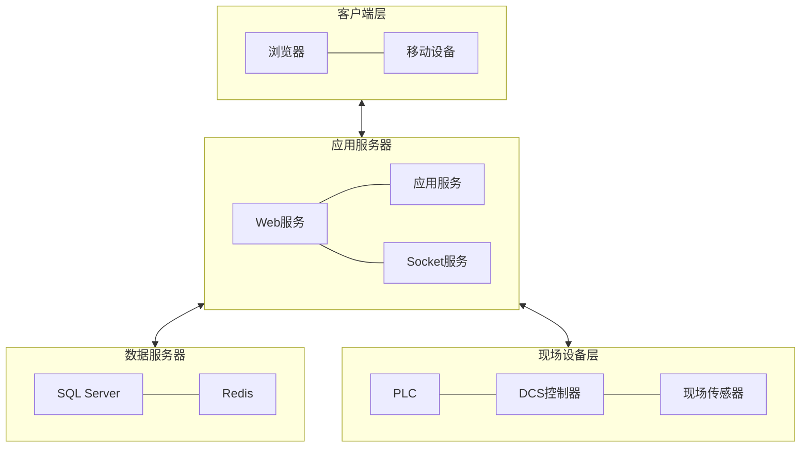

## RuoYi-Vue-SQLServer

一直很喜欢的RuoYi，无奈之前的SQLServer版本停止更新了，所以12-04在最新版Vue前后端分离代码上，整合修改为了SQLServer版本。

主要修改如下：
* 修改com.ruoyi.quartz.config.ScheduleConfig，启用SQLServer
* MySQL转SQLServer部分SQL书写修改，如：ifnull→isnull，sysdate→getdate，data_format→CONVERT，FIND_IN_SET→CHARINDEX
* application.yml PageHelper分页插件修改为sqlserver
* application-druid.yml数据源
* ruoyi-admin下的pom.xml引入mssql-jdbc
* 数据库部分字段修改（sys_notice）

## 平台简介

若依是一套全部开源的快速开发平台，毫无保留给个人及企业免费使用。

* 前端采用Vue、Element UI。# 铝电解DCS系统项目分析报告

## 1. 项目概述

本项目是基于若依（RuoYi）框架开发的铝电解工业分布式控制系统(DCS)，主要用于监控和管理铝电解生产过程中的电解槽运行状态、工艺参数和生产数据，实现生产过程的自动化控制与优化。

## 2. 项目结构

项目采用模块化设计，各模块功能清晰，职责分明：



### 主要模块说明：

- **ruoyi-admin**：系统启动入口和Web配置
- **ruoyi-framework**：核心框架模块，提供安全控制、拦截器等
- **ruoyi-system**：系统管理模块，包含用户、角色、权限等
- **ruoyi-common**：通用工具模块，提供各种工具类
- **ruoyi-quartz**：定时任务模块，负责计划任务的执行
- **ruoyi-generator**：代码生成模块，提升开发效率
- **ruoyi-industry**：业务核心模块，实现铝电解工业相关功能
- **ruoyi-ui**：前端Vue项目，实现用户界面

## 3. 技术架构

系统采用主流的技术栈，前后端分离架构：



### 技术选型：

#### 后端技术栈
- **基础框架**：Spring Boot 2.5.10
- **安全框架**：Spring Security + JWT
- **持久层**：MyBatis + PageHelper
- **数据库**：SQL Server（由MySQL版本改造）
- **缓存**：Redis
- **定时任务**：Quartz
- **连接池**：Druid
- **其他**：fastjson、commons-io等

#### 前端技术栈
- **框架**：Vue.js
- **UI组件**：Element UI
- **HTTP客户端**：Axios
- **状态管理**：Vuex
- **构建工具**：Webpack

#### 通信方式
- **HTTP**：RESTful API
- **UDP**：Socket通信（实时数据采集）

## 4. 业务功能

系统实现的主要业务功能包括：

```mermaid
graph LR
    A[铝电解DCS系统] --> B[实时监控]
    A --> C[生产参数管理]
    A --> D[报警管理]
    A --> E[数据分析]
    A --> F[远程控制]
    A --> G[系统管理]
    
    B --> B1[电解槽状态监控]
    B --> B2[工艺参数监控]
    B --> B3[设备通信状态]
    
    C --> C1[工艺参数设置]
    C --> C2[参数历史记录]
    C --> C3[参数模板管理]
    
    D --> D1[阳极效应(AE)报警]
    D --> D2[异常状态报警]
    D --> D3[通信中断报警]
    
    E --> E1[生产数据统计]
    E --> E2[趋势分析]
    E --> E3[报表生成]
    
    F --> F1[远程参数调整]
    F --> F2[模式切换]
    F --> F3[远程指令下发]
    
    G --> G1[用户权限管理]
    G --> G2[系统配置]
    G --> G3[日志管理]
```

### 核心业务功能：

1. **电解槽实时监控**
   - 实时显示电解槽状态、电压、电流等参数
   - 自动刷新数据，支持多厂区切换
   - 显示连接状态，识别通信中断设备

2. **阳极效应(AE)监测**
   - 记录AE发生时间、持续时间和类型
   - 统计24小时内AE发生次数
   - 提供AE数据分析功能

3. **参数管理**
   - 设定电压、氟盐量等工艺参数管理
   - 参数修改记录追踪
   - 支持参数批量修改

4. **远程控制**
   - 支持自动/手动/半自动模式切换
   - 远程操作控制（RC升降、加料等）
   - 远程参数调整

5. **数据分析**
   - 工艺参数趋势分析
   - 生产数据统计报表
   - 电解槽性能评估

## 5. 核心业务模型

系统核心业务模型设计如下：



## 6. 系统流程

### 6.1 实时数据采集流程



### 6.2 参数修改流程



### 6.3 报警处理流程



## 7. 部署架构

系统采用分层部署架构：



## 8. 关键技术实现

### 8.1 实时数据通信

系统通过UDP Socket实现与DCS设备的通信，主要配置和实现在：
- `ruoyi-industry/src/main/java/com/ruoyi/industry/socket/Client.java`
- 配置文件中指定UDP端口：`socket.udp.port=9010`

### 8.2 数据展示

前端通过轮询方式定时获取最新数据，实现实时数据显示：
- 主界面：`ruoyi-ui/src/views/realTime/index.vue`
- 数据接口：`RealTimeDataDisplayController.java`

### 8.3 安全控制

系统采用Spring Security + JWT实现安全控制：
- 配置了token自定义标识、密钥和有效期
- 支持用户角色和权限的细粒度控制

## 9. 系统特色

1. **多区域管理**：支持多厂区、多区域的分级管理
2. **实时监控**：毫秒级数据更新，实时掌握生产状态
3. **远程控制**：支持远程参数调整和控制指令下发
4. **异常预警**：自动监测并报警高频/低频噪声和阳极效应
5. **数据分析**：提供丰富的数据统计和分析功能
6. **灵活配置**：系统参数可通过配置文件灵活调整

## 内置功能

1.  用户管理：用户是系统操作者，该功能主要完成系统用户配置。
2.  部门管理：配置系统组织机构（公司、部门、小组），树结构展现支持数据权限。
3.  岗位管理：配置系统用户所属担任职务。
4.  菜单管理：配置系统菜单，操作权限，按钮权限标识等。
5.  角色管理：角色菜单权限分配、设置角色按机构进行数据范围权限划分。
6.  字典管理：对系统中经常使用的一些较为固定的数据进行维护。
7.  参数管理：对系统动态配置常用参数。
8.  通知公告：系统通知公告信息发布维护。
9.  操作日志：系统正常操作日志记录和查询；系统异常信息日志记录和查询。
10. 登录日志：系统登录日志记录查询包含登录异常。
11. 在线用户：当前系统中活跃用户状态监控。
12. 定时任务：在线（添加、修改、删除)任务调度包含执行结果日志。
13. 代码生成：前后端代码的生成（java、html、xml、sql）支持CRUD下载 。
14. 系统接口：根据业务代码自动生成相关的api接口文档。
15. 服务监控：监视当前系统CPU、内存、磁盘、堆栈等相关信息。
16. 缓存监控：对系统的缓存信息查询，命令统计等。
17. 在线构建器：拖动表单元素生成相应的HTML代码。
18. 连接池监视：监视当前系统数据库连接池状态，可进行分析SQL找出系统性能瓶颈。
